# linkedin java collections
[course](https://www.linkedin.com/learning/learning-java-collections)

# Collections
useful to work with data

# Collections generics
is useful to catch most of the problems during compilation time

# Map

key-value collection
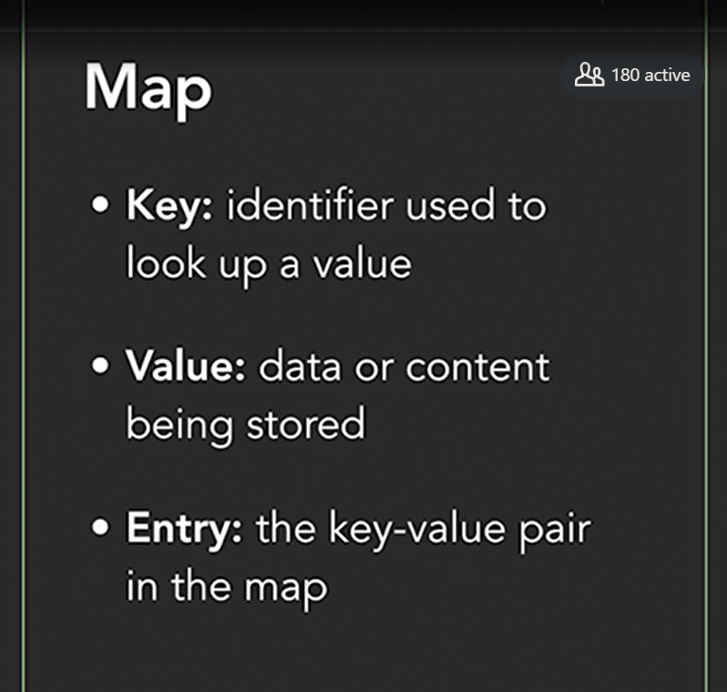  
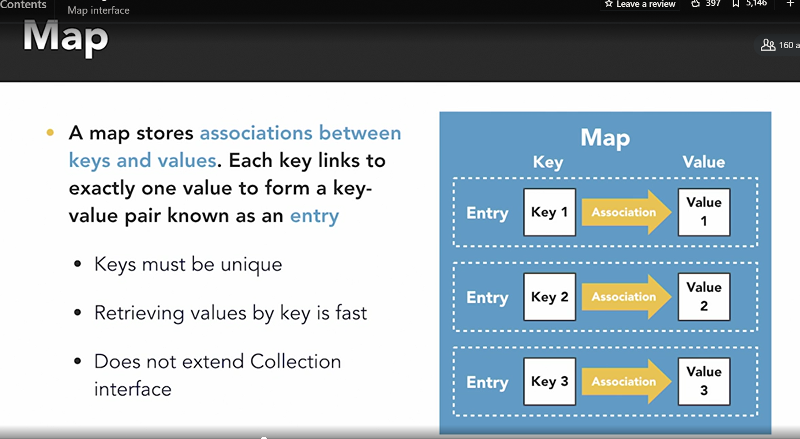  
- (key,value) pair is call entry
- key should be unique

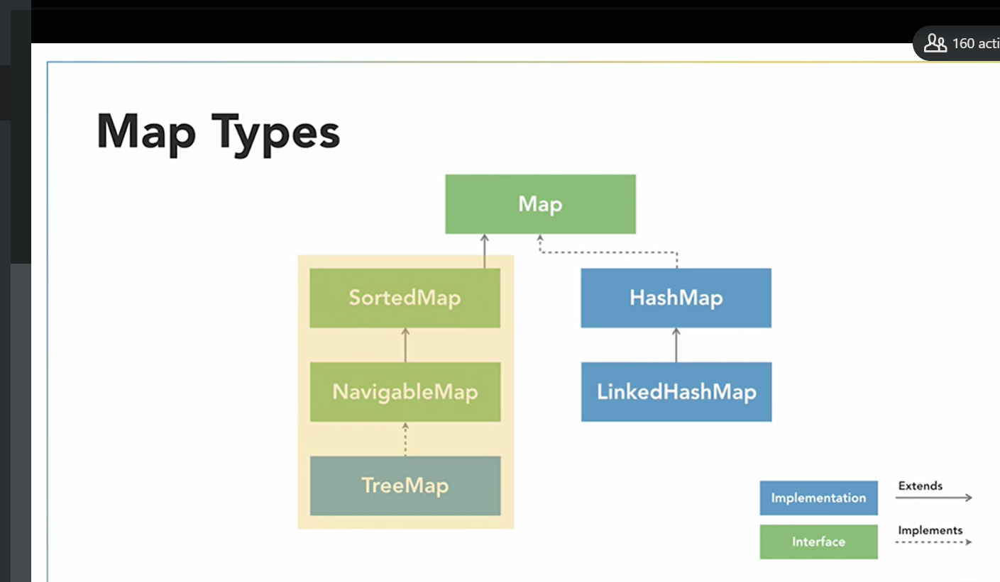  

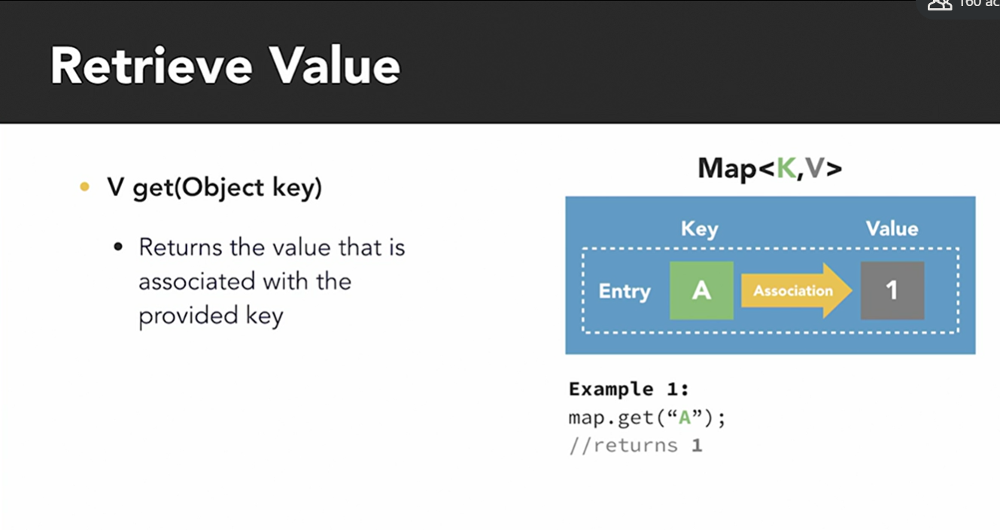  
- get value using key

# Map put
put returns the current associated value, or null if is new

```java
Map<String, String> map = new HashMap<>(); 
map.put("a", "1");
map.put("b", "2");
map.put("c", "3");
String value = map.put("c", "5");
value;
```
# Map key
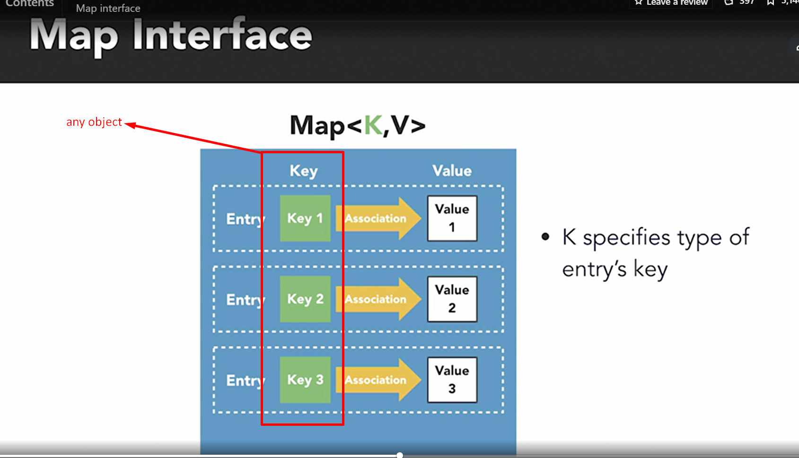  
- you need to override hashCode and equals method on the key class

```java
class Employee{
    private String name;
    private Integer age;
    public Employee(String name, Integer age){
        this.name=name;
        this.age=age;
    }
    public String getName(){return this.name;}
    public String setName(String name){return this.name;}

    public Integer getAge(){return this.age;}
    public Integer setAge(Integer age){return 
    this.age;}

    @Override
    public boolean equals(Object obj){
        if(this == obj){
            return true;
        }
    
        if(obj == null){
            return false;
        }
    
        if(getClass() != obj.getClass()){
            return false;
        }
    
        Employee employee = (Employee)obj;
    
        if(name == null){
            if(employee.getName() != null){
                return false;
            }
        }else if(!name.equals(employee.getName())){
            return false;
        }
    
        if(age != this.getAge()){
            return false;
        }
    
        return true;
    }
    
    @Override
    public int hashCode() {
        return this.age;
    }
} 

Map<Employee,String> mapLastname = new HashMap<Employee, String>();
mapLastname.put(new Employee("daniel", 1), "yepes");
mapLastname.put(null, "yepes");
mapLastname
```

# LinkedHashMap  
- preserves the order of the insertion
```java
Map<String, String> map = new LinkedHashMap<>(); 
map.put("a", "1");
map.put("b", "2");
map.put("c", "3");
map;
```

# HashMap
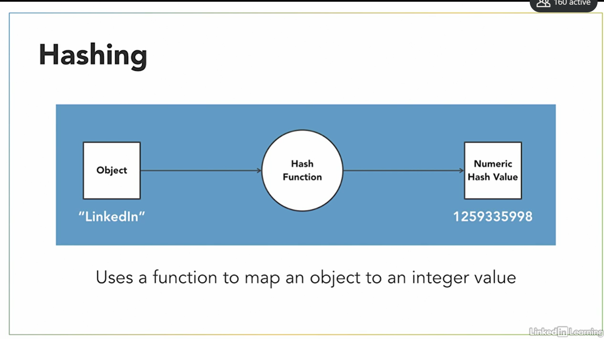  
- avoid collisions
    - to there is come collision with the hash value, they the map uses the equals value
  
```java
Map<String, String> map = new HashMap<>(); 
map.put("a", "1");
map.put("b", "2");
map.put("c", "3");
map;
```
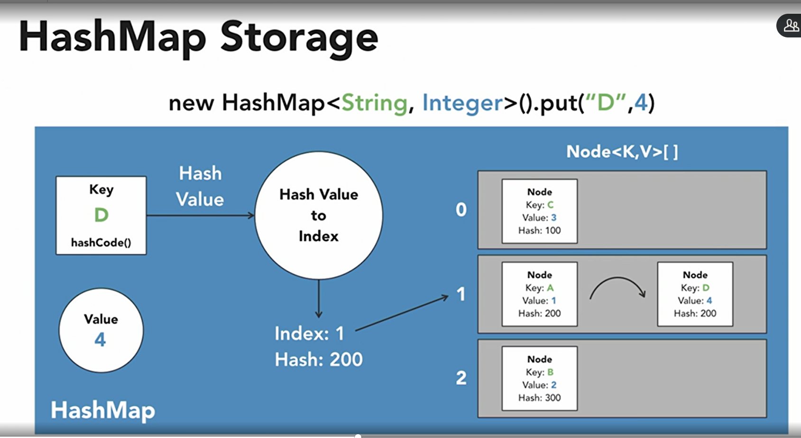  
- it uses an array to stores the entries
- the default size is 16
- the has function is execute twice to get the final index in the array

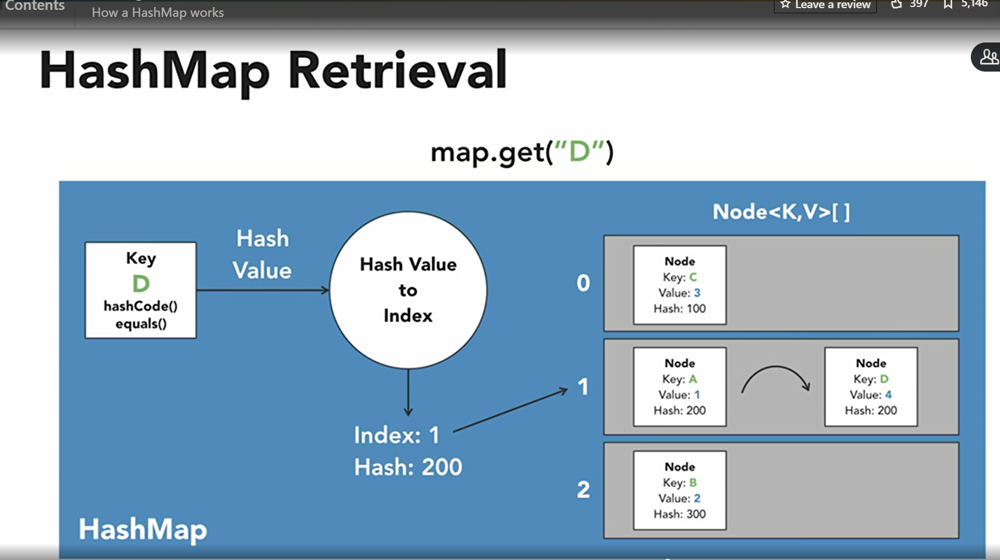  
this happens again for get values

# Hashtable (synchronized)
useful when you need multithread
```java
Map<String, String> map = new Hashtable<>(); 
map.put("a", "1");
map.put("b", "2");
map.put("c", "3");
map; 
```

# WeakHashMap 
```java
Map<String, String> map = new WeakHashMap<>(); 
map.put("a", "1");
map.put("b", "2");
map.put("c", "3");
System.gc();
map;
```

# IdentityHashMap
uses "==" instead of "equals"

```java
class Employee{
    private String name;
    private Integer age;
    public Employee(String name, Integer age){
        this.name=name;
        this.age=age;
    }
    public String getName(){return this.name;}
    public String setName(String name){return this.name;}

    public Integer getAge(){return this.age;}
    public Integer setAge(Integer age){return 
    this.age;}

    @Override
    public boolean equals(Object obj){
        if(this == obj){
            return true;
        }
    
        if(obj == null){
            return false;
        }
    
        if(getClass() != obj.getClass()){
            return false;
        }
    
        Employee employee = (Employee)obj;
    
        if(name == null){
            if(employee.getName() != null){
                return false;
            }
        }else if(!name.equals(employee.getName())){
            return false;
        }
    
        if(age != this.getAge()){
            return false;
        }
    
        return true;
    }
    
    @Override
    public int hashCode() {
        return this.age;
    }
} 
Map<Employee, String> map = new IdentityHashMap<>(); 
map.put(new Employee("daniel", 1), "yepes");
map.put(new Employee("alejo", 1), "yepes");
map.put(new Employee("daniel", 1), "yepes");
map.put(new Employee("daniel", 1), "yepes");
System.gc();
map;
```

# Map put if not exists
```java
map.putIfAbsent("c", "6");
```
this methods returns null if the value was inserted, other way return the value

# Map keySet, entrySet, values
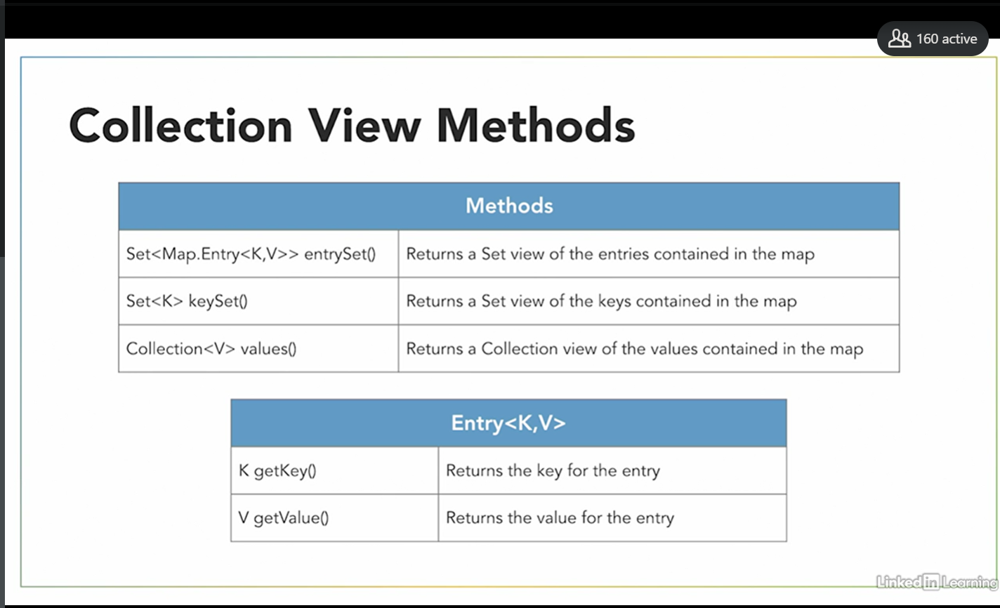  
let you interact with their internal collections

```java
Map<Employee, String> map = new IdentityHashMap<>(); 
map.put(new Employee("daniel", 1), "yepes");
map.put(new Employee("alejo", 1), "yepes");
map.put(new Employee("daniel", 1), "yepes");
map.put(new Employee("daniel", 1), "yepes");
map.keySet().stream().forEach(System.out::println);
map.entrySet().stream().forEach(System.out::println);

map.values().stream().forEach(System.out::println);
```
# TreeMap

# List
- linear indexed collection
- it's access is random, you just need the position or the key to access to it
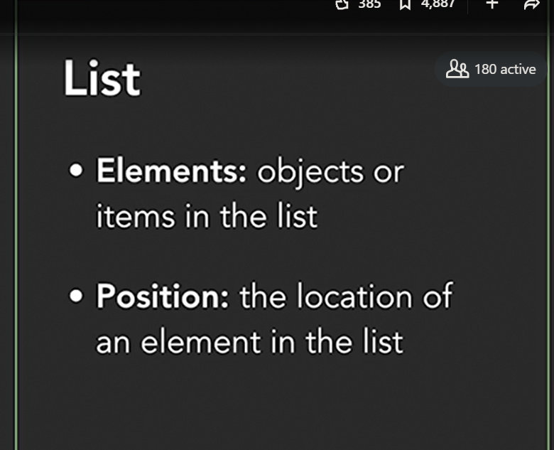  
  
# java collection framework

    

## collection operations
- store: some collection store data pretty faster
- organize: some collections put the new value at the beginning or at the end
- manage: each collection has different operations
- retrieve: some collections are slower than other retrieving data


# store
  
# organize
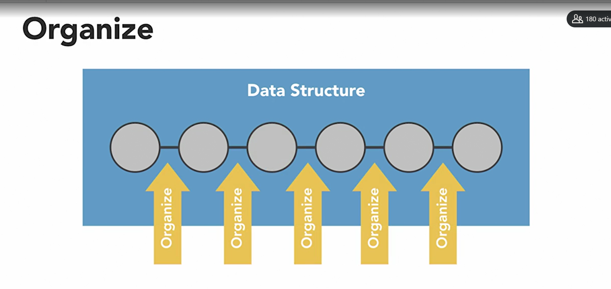  
- Queue: insert right remove from left (FIFO)
- Stack: insert to right remove from right (LIFO)  

  

- Tree: handle hierarchy
- Hash: handle keys and buckets 

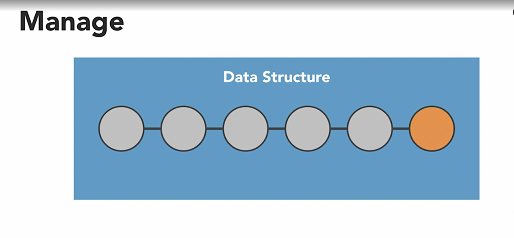  
operations over the collection object

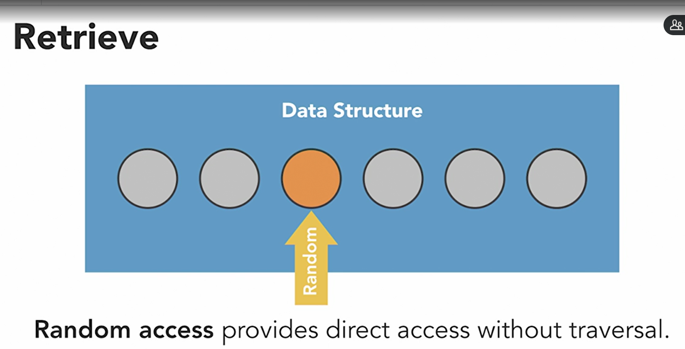  
each collection object retrieve the element different, some of them are really good doing this

# collection framework history
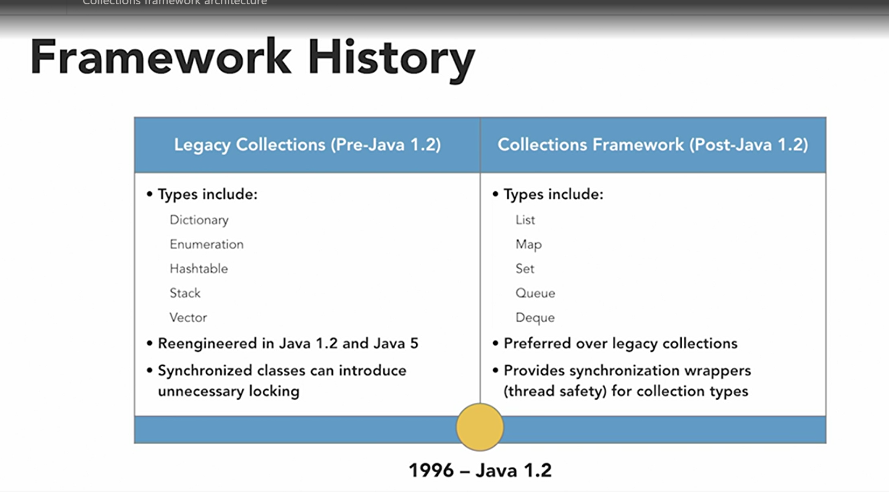  
# Dictionary
# Enumeration
# Hashtable (Deprecated)
- let you work with objects
- some issues with the performance

# Iterable
- just go in one direction
- contains two basic methods
    - has next
    - next
- each Iterable implementation could be use in a foreach loop
```java
Collection<Integer> numbers = Arrays.asList(1, 2, 3, 4, 5, 6, 7, 8, 9, 10); 
Iterator<Integer> iter = numbers.iterator();
```

# Collection
  
is the general interface for all collection objects in the collections api, contains methods for :
- check if contain
- add element
- does not contain get, because by default it is not indexablew
- return an stream 
- some implementations may throw an exception when the method is called  
- these collections are mutable, therefore any call to remove method will change the original collection

# List
# Vector (implementation)
- fail-fast implementation: if you change the vector inside a for iteration, then it will throw an exception to prevent unexpected behavior

- thread safe collection
```java
Vector vector = new Vector<>();
vector.add("daniel");
vector.add("molina");
vector.stream().forEach(System.out::println);
```
# ArrayList  (implementation)
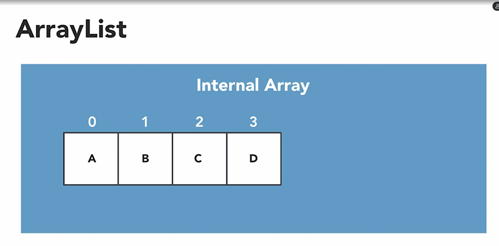  
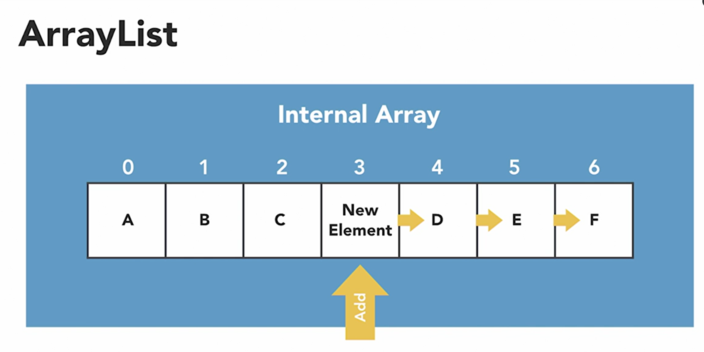  
- good performance reading
- bad performance adding new elements in any position
- you can set an initial capacity to avoid to much resizing

```java
List<String> listFood = new ArrayList<String>(100);
listFood.addAll(Arrays.asList("milk", "banana", "water", "orange", "rice"));
```

# LinkedList  (implementation)
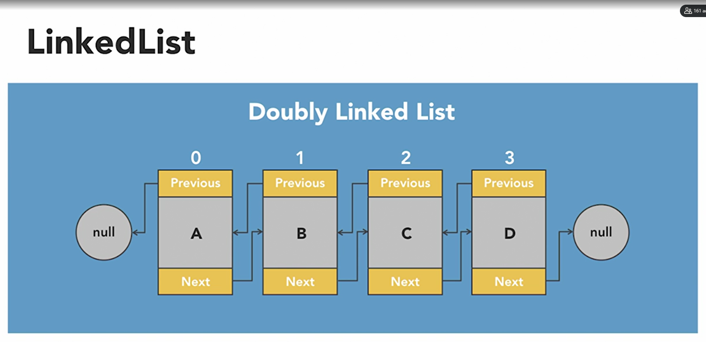  
- slow performance reading
- god performance adding elements in any position

# LinkedList (implementation)
  
is an implementation for Queue, Deque and List, linked implementation let the collection add elements in any position and iterate in any direction  
- deque  let you addFirst, addLast, getFirst, getLast, pollFirst, pollLast
- queue let you add, poll and peak
- list let you add, get and remove

```java
Deque<String> deque = new LinkedList<>();
deque.addFirst("daniel");
deque.addLast("name last");

Queue<String> queue = new LinkedList<>();
queue.add("test");
queue.peak();

List<String> list = new LinkedList<>();
list.add("name");
list.add("lastname");
list.get(0);
list.remove(0);

deque.stream().forEach(System.out::println);
queue.stream().forEach(System.out::println);
list.stream().forEach(System.out::println);

deque.pollFirst();
deque.pollLast();

queue.poll();

list.remove(0);
```

# ListIterator  (interface)
- let you add, remove and reverse the iteration

# Stack

# List
# Map
# Set
- doesn't not allow duplicate values
- for custom class you need to override equals method

```java
Set<String> set = new TreeSet();
set.add("test");

Set<String> setSample = Set.of("test 1", "test 2", "test 3");


Set.copyOf(Arrays.asList(1, 2, 3, 4, 5, 6, 7, 8, 9, 10)).stream().forEach(System.out::println);

setSample.stream().forEach(System.out::println);
```

# NavigableSet - interface
- allows you to iterate in any direction
- let you get elements which are greater or less than a given value

```java
NavigableSet<String> set = new TreeSet<>();
set.add("alba");
set.add("whole");
set.add("shaky");
set.add("severe");

set.stream().forEach(System.out::println);

set.descendingSet().stream().forEach(System.out::println);

set.ceiling("casa");
set.headSet("walter").stream().forEach(System.out::println);

set.floor("walter");
set.tailSet("casa").stream().forEach(System.out::println);

set.subSet("a", "risotto").stream().forEach(System.out::println);
```

# HashSet
- best performance
- there is not order in the elements
```java
Set<String> set = new HashSet();
set.add("test"); 
set.add("test1 0"); 
set.add("test 7 0"); 
set.stream().forEach(System.out::println);
```

# LinkHashSet
save elements in the same order they were added
```java
Set<String> set = new LinkedHashSet();
set.add("test"); 
set.add("test1 0"); 
set.add("test 7 0"); 
set.stream().forEach(System.out::println);
```

# TreeSet
- save the elements in order 
- need to implement comparable interface in case the object inside is a custom class
```java
Set<String> set = new TreeSet();
set.add("test"); 
set.add("test1 0"); 
set.add("test 7 0"); 
set.stream().forEach(System.out::println);
```

# Set.of
immutable set, you can't add or remove elements in there
```java
Set<String> setSample = Set.of("test 1", "test 2", "test 3");
```

# Set.copyOf
make a immutable copy of the original set
```java
Set.copyOf(Arrays.asList(1, 2, 3, 4, 5, 6, 7, 8, 9, 10)).stream().forEach(System.out::println); 
```

# Queue
  
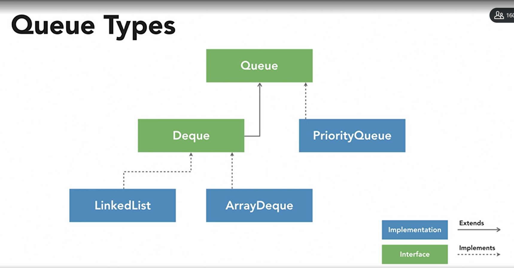  
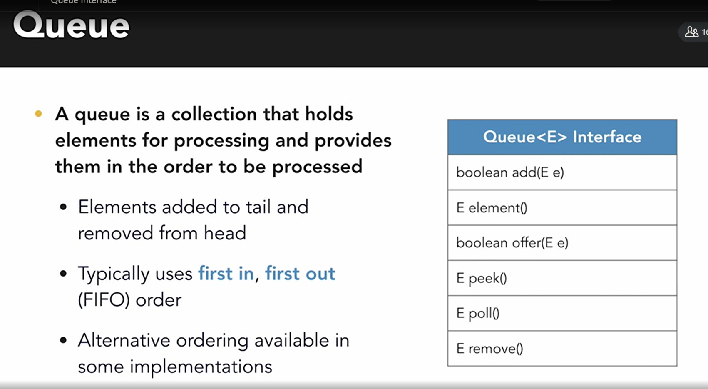
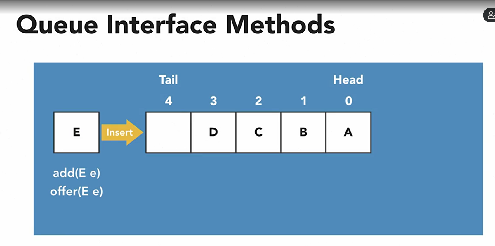  
  
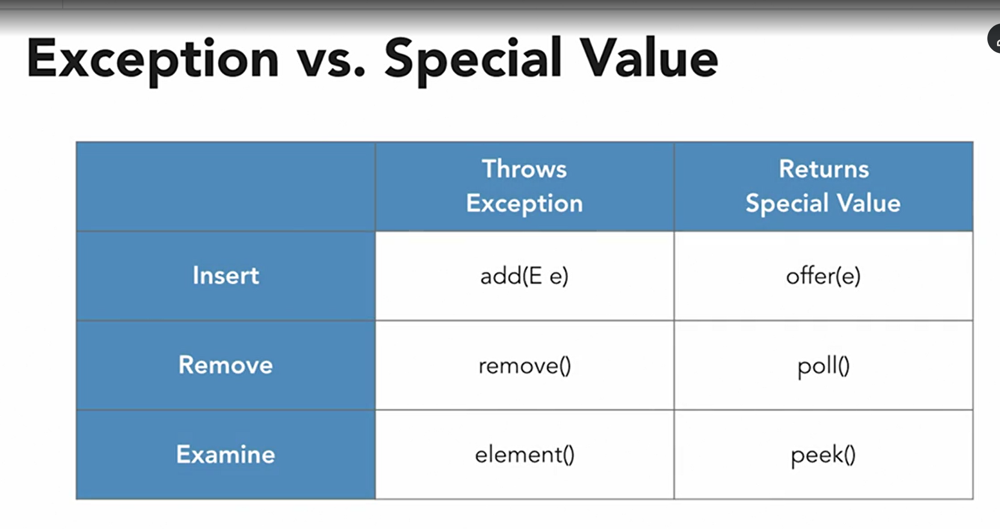  
- a queue let you add at the end and remove from the beginning, is a FIFO collection
- collection methods throws exception
- queue methods return null

# PriorityQueue
the elements needs to be sorted to determine the priority
```java
Queue<String> queue = new PriorityQueue<>();
queue.add("zack");
queue.add("daniel");
queue.add("molina");
queue.add("gabriela");
queue.add("antonela");

queue.peek();
queue.poll();
queue.peek();
```

```java
class Employee{
    private String name;
    private Integer age;
    public Employee(String name, Integer age){
        this.name=name;
        this.age=age;
    }
    public String getName(){return this.name;}
    public String setName(String name){return this.name;}

    public Integer getAge(){return this.age;}
    public Integer setAge(Integer age){return this.age;}

    public String toString(){
        return "name: "+this.name+" age: "+this.age;
    }
}
Queue<Employee> queue = new PriorityQueue<>(Comparator.comparing(Employee::getAge).reversed());
queue.add(new Employee("daniel", 19));
queue.add(new Employee("alejandro", 88));
queue.add(new Employee("jose", 33));
queue.stream().forEach(System.out::println);
```

# Deque Interface
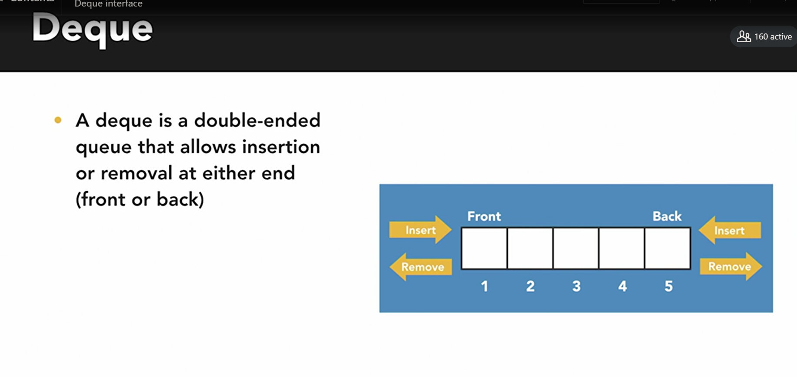  

# Deque as a Queue
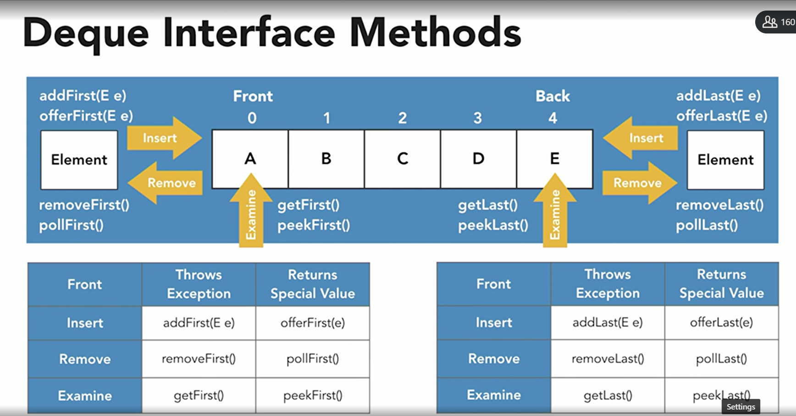  
- let you add and remove from the beginning and the end of the collection
- offer, poll, peak null()
- add, remove, get (exception)
- use first and last prefix

# ArrayDeque Implementation
- implementation base on array
- useful to represent a queue or a stack
- java recommends to use Deque as an Stack

```java
Deque<String> deque = new ArrayDeque<>();
deque.addFirst("name first");
deque.addLast("name last");
deque.getFirst();
deque.getLast();

deque.iterator().
    forEachRemaining(System.out::println);

deque.descendingIterator().
    forEachRemaining(System.out::println);

deque.pollFirst();
deque.stream().forEach(System.out::println);
deque.pollLast();
```

# Queue peek vs poll
- peek just read
- poll remove and read
```java
Queue<String> deque = new ArrayDeque<>();
deque.offer("daniel");
deque.poll();
deque.peek();
```

# Deque as a Stack
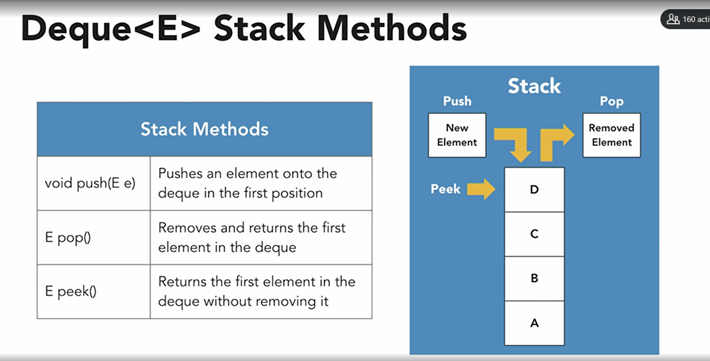  
```java
Deque<String> stack = new ArrayDeque<>();
stack.push("daniel");
stack.push("alejandro");
stack.push("molina");
stack.push("yepes");
stack.pop();
stack.peak();
stack.stream().forEach(System.out::println);
```


# List remove
remove returns a the removed value
```java
List<String> list = new ArrayList<>();
list.add("sample"); 
list.remove(0);
```

# List index operations
- there are lot of operations for list, with index, set is one of them list.set(index, element)
- add and addAll both of them receive an index
```java
List<Integer> numbers = new ArrayList<>();
numbers.add(1);
numbers.add(2);
numbers.add(3);
numbers.add(5);
numbers.add(4);
numbers.get(0);
numbers.lastIndexOf(6);
numbers.indexOf(9);
numbers.set(2, 11);
numbers.remove(3);
numbers.subList(0,2);
numbers.addAll(2, Arrays.asList(1, 2, 3, 4, 5, 6, 7, 8, 9, 10));
numbers;
```

# List sorting
```java
class Employee{
    private String name;
    private Integer age;
    public Employee(String name, Integer age){
        this.name=name;
        this.age=age;
    }
    public String getName(){return this.name;}
    public String setName(String name){return this.name;}

    public Integer getAge(){return this.age;}
    public Integer setAge(Integer age){return this.age;}
}
List<Employee> employees = new ArrayList<>();
employees.add(new Employee("juan", 20));
employees.add(new Employee("daniel", 25));
employees.add(new Employee("jose", 30));
employees.add(new Employee("maria", 20));
employees.add(new Employee("leidy", 25));
employees.add(new Employee("carlos", 30));

employees.sort(
    Comparator.comparing(Employee::getName)
		.thenComparing(Employee::getAge));

employees.stream().map(Employee::getName).forEach(System.out::println);
```

# Sort complex comparator
let you sort the collection using multiple object properties

```java
Comparator.comparing(Employee::getName)
		.thenComparing(Employee::getAge)
```

# List.of
```java
class Employee{
    private String name;
    private Integer age;
    public Employee(String name, Integer age){
        this.name=name;
        this.age=age;
    }
    public String getName(){return this.name;}
    public String setName(String name){return this.name;}

    public Integer getAge(){return this.age;}
    public Integer setAge(Integer age){return this.age;}
}
Collection<Employee> employees = List.of(
    new Employee("juan", 20),
    new Employee("daniel", 25),
    new Employee("jose", 30),
    new Employee("maria", 20),
    new Employee("leidy", 25),
    new Employee("carlos", 30)
);
employees.stream().mapToInt(Employee::getAge).sum();
```

# Collections types (basic interfaces)
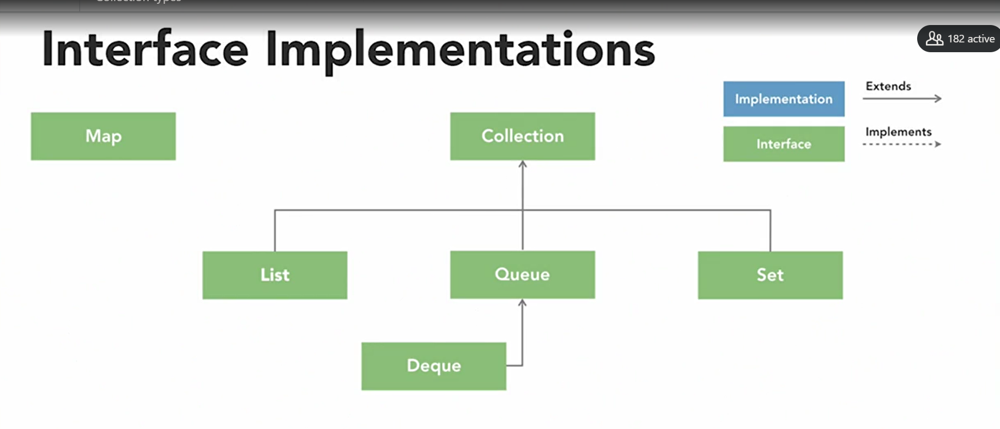  

- Map
- Collection
    - List
    - Set
    - Queue
    - Deque

  
  

# Collections implementation
there are four basic implementations
1. base on array
2. base on hash
3. base on linked list
4. base on tree

# Collection naming convention
- <implementation><interface>
- the interface comes at the end
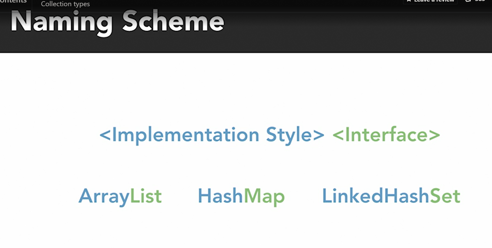  

```java
ArrayList
HashMap
LinkedHashSet
```

# Collection common implementations
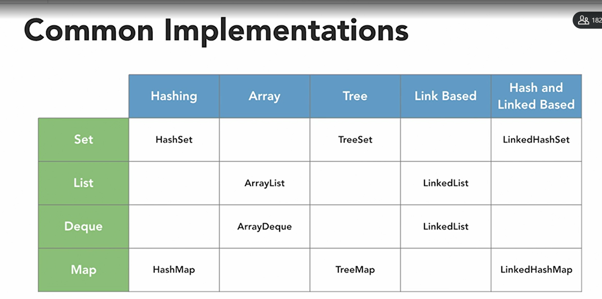  

# Collection TreeMap
- the keys are sorted automatically
- uses a tree as it's implementation
- slow for retrieving data
- slow for putting data

```java
Map<String,String> map = new TreeMap<>();
map.put("name", "daniel");
map.put("age", "zack");
map.put("zipcode", "cii");
map.put("city", "d");
map.values().stream().forEach(System.out::println);
map.keySet().stream().forEach(System.out::println);
map.entrySet().stream().forEach(System.out::println);
```

# Collections class 
# Collection synchronized set
let you keep the set thread safe
```java
Set<String> set = new TreeSet();
set.add("test");
set.add("test");

Set<String> synset = Collections.synchronizedSet(set);
```

# Collections and null values
some collection implementation doesn't allow null values in there

- there is a group of implementation that doesn't not allow null values
1. TreeSet: null values doesn't have any order
2. TreeMap: is hard to determine where to put a null value in a sorted collection
3. ArrayDeque: null value is already an indicator for an empty deque
4. PriorityQueue: the queue is sorted to determine the priority, then you can't put null values

on sorted collections, you could not insert null values
```java
Set<String> treeSet = new TreeSet<>();
treeSet.add(null); //⚠

Set<String> hashSet = new HashSet<>();
hashSet.add(null);

Set<String> linkedHashSet = new LinkedHashSet<>();
linkedHashSet.add(null);

List<String> arrayList = new ArrayList<String>();
arrayList.add(null);

List<String> linkedList = new LinkedList<String>();
linkedList.add(null);

Deque<String> deque = new ArrayDeque<>();
deque.add(null); //⚠

Deque<String> linkedDeque = new LinkedList<>();
linkedDeque.add(null);

Queue<String> queue = new LinkedList<>();
queue.add(null);

Queue<String> priorityQueue = new PriorityQueue<>();
priorityQueue.add(null); //⚠
```

# Collection interface methods
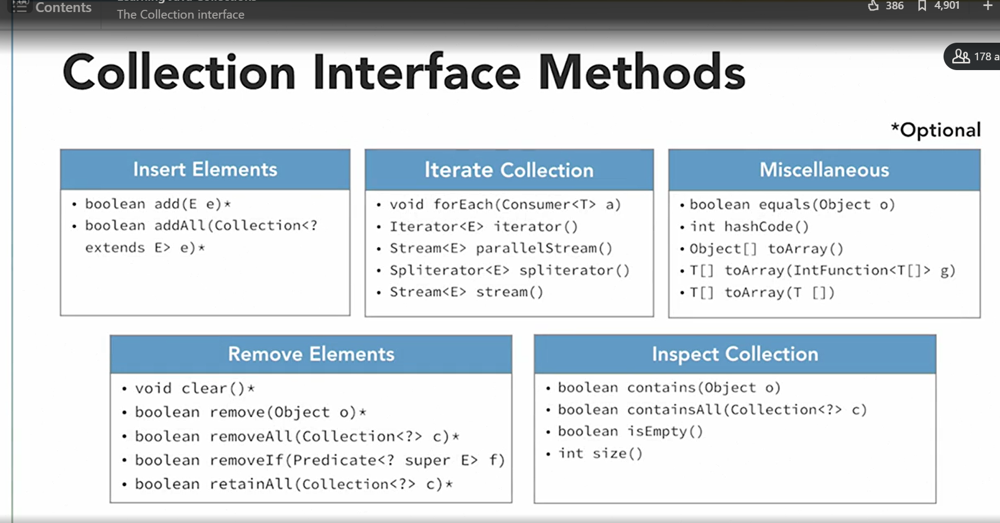  
- retainAll: keep all the elements who belongs to the second collection element

```java
Set<String> set = new TreeSet<>();
set.add("test");
set.add("test");

Set<String> set2 = new TreeSet<>();
set.add("test2");
set.add("test2");

set.addAll(set2);
set.containsAll(set2);
set.retainAll(set2);
set.contains("test");
set.isEmpty();
set.removeIf(s->s.equals("test"));

set.stream().forEach(System.out::println);
```

# Collection insert method
- add and addAll returns a boolean flag which indicates if the collection changed or not
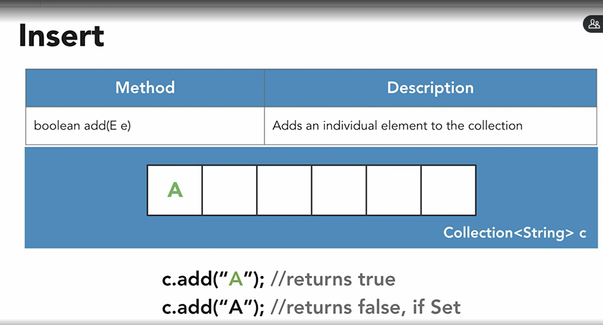  


# Collection remove method
- remove , removeAll and retainAll returns a boolean flag which indicates if the collection changed or not
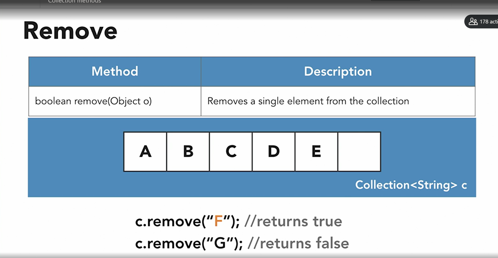  

# Collection contains method
- contains or containsAll returns a boolean flag which indicates if the collection contains the element or not
- to determine this, they use equals method under the hook
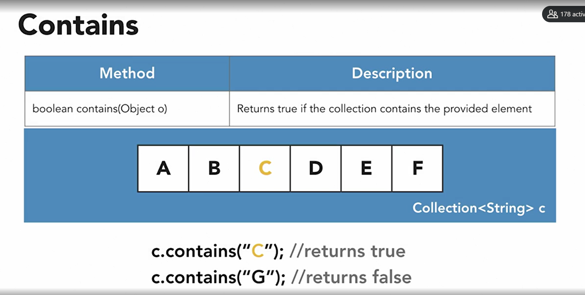  

# Collection with not type
if you don't want to use generics, then just leave out the "<>" symbol and work with objects directly
```java
Collection collection = new HashSet();
collection.add("some2");
collection.size();
```

# Collection constructors
you can pass a collection as a parameter of other collection constructor
```java
Collection<String> c1 =  new ArrayList<>();
c1.add("name 1");
c1.add("name 2");
c1.add("name 3");
c1.add("name 3");
c1.add("name 3");

Collection<String> c2 =  new TreeSet<>(c1);
c1.stream().forEach(System.out::println);
c2.stream().forEach(System.out::println);
```

# collection comparison methods
if you have a particular class, then you need to override equals method to let these methods work properly
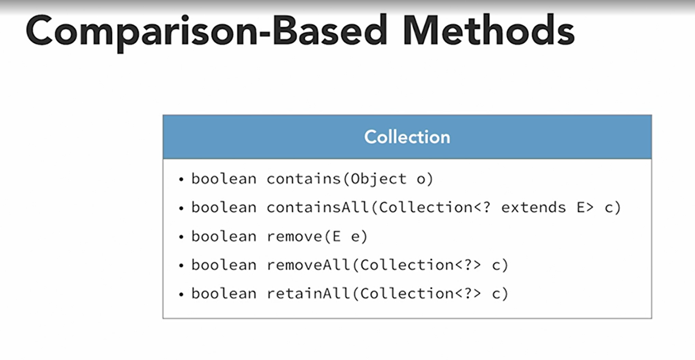  

# Collections override equals
- when you override equals you need to override hasCode as well

```java
class Employee{
    private String name;
    private Integer age;
    public Employee(String name, Integer age){
        this.name=name;
        this.age=age;
    }
    public String getName(){return this.name;}
    public String setName(String name){return this.name;}

    public Integer getAge(){return this.age;}
    public Integer setAge(Integer age){return this.age;}

    @Override
    public boolean equals(Object o){
        Employee employee = (Employee)o;
        return this.getName().equals(employee.getName());
    }

    @Override
    public int hashCode() {
        return this.age;
    }
}

Set<Employee> setEmployee = new HashSet<>();
setEmployee.add(new Employee("daniel", 1));
setEmployee.add(new Employee("aleja", 3));
setEmployee.add(new Employee("daniel", 10));
setEmployee.stream().map(Employee::getName).forEach(System.out::println);
```

# Collections override compareTo
you need to override comparable if you want your object to be sortable
```java
class Employee implements  Comparable<Employee>{
    private String name;
    private Integer age;
    public Employee(String name, Integer age){
        this.name=name;
        this.age=age;
    }
    public String getName(){return this.name;}
    public String setName(String name){return this.name;}

    public Integer getAge(){return this.age;}
    public Integer setAge(Integer age){return this.age;}

    @Override
    public boolean equals(Object obj){
        if(this == obj){
            return true;
        }

        if(obj == null){
            return false;
        }

        if(getClass() != obj.getClass()){
            return false;
        }

        Employee employee = (Employee)obj;

        if(name == null){
            if(employee.getName() != null){
                return false;
            }
        }else if(!name.equals(employee.getName())){
            return false;
        }

        if(age != this.getAge()){
            return false;
        }

        return true;
    }

    @Override
    public int hashCode() {
        return this.age;
    }

    @Override
    public int compareTo(Employee e){
        return this.getName().compareTo(e.getName());
    }
}

Set<Employee> setEmployee = new TreeSet<>();
setEmployee.add(new Employee("daniel", 1));
setEmployee.add(new Employee("aleja", 3));
setEmployee.add(new Employee("daniel", 10));
setEmployee.stream().map(Employee::getName).forEach(System.out::println); 
```

# Collection Stack
```java
Stack<String>  stack = new Stack<>();
stack.push("one");
stack.push("two");
stack.push("last");
stack.peek();
stack.search("one");
```

# Collection iteration
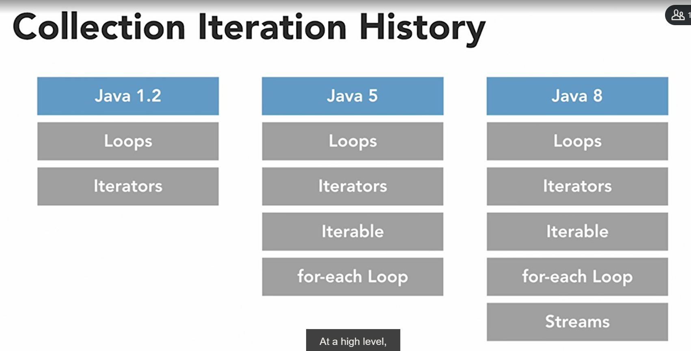
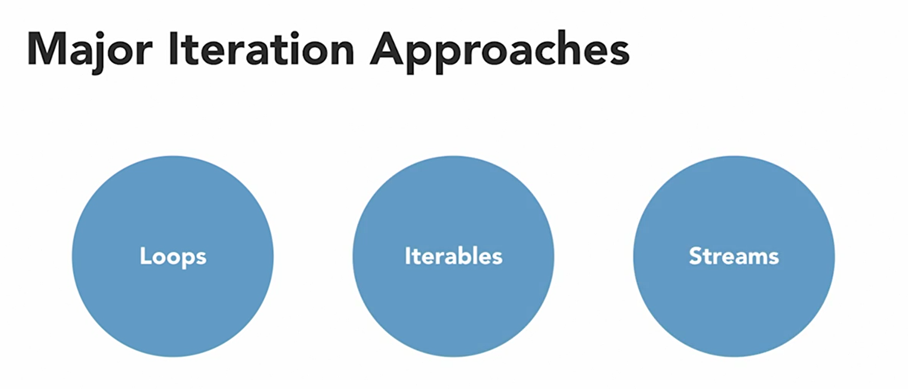  
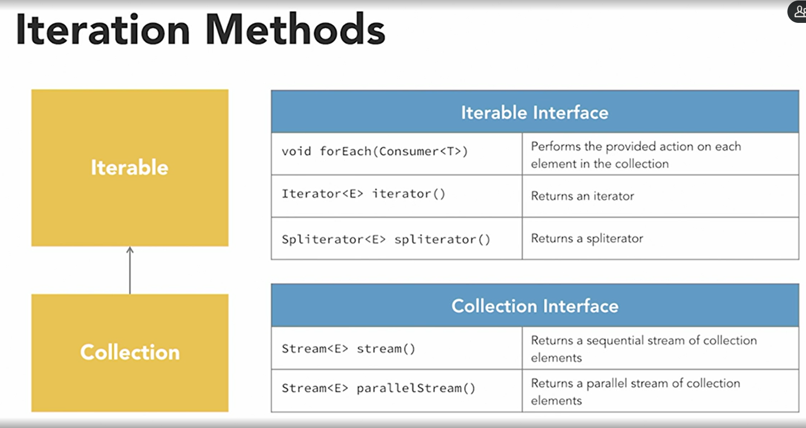  

# Iterator sample
- provides two methods to go through the collection
- each call to .iterator() return it's own independent sequence

```java
List<String> listFood = Arrays.asList("milk", "banana", "water", "orange", "rice");
Iterator<String> ite = listFood.iterator();
while(ite.hasNext()){
    String value = ite.next();
    System.out.println(value);
}
```

# Iterator reverse
- it just applies for deque implementations
```java
Deque<Integer> numbers = new ArrayDeque<>(new LinkedList<>(Arrays.asList(1, 2, 3, 4, 5, 6, 7, 8, 9, 10)));
Iterator<Integer> nu = numbers.descendingIterator();
while(nu.hasNext()){
    System.out.println(nu.next());
}
```

# Concurrent modification exception
for-each prevent concurrent access to the collection, therefore if you change the collection in a for-each it throws an java.util.ConcurrentModificationException
```java
List<String> listFood = new ArrayList<String>(Arrays.asList("milk", "banana", "water", "orange", "rice"));

for(String element: listFood){
    listFood.remove(element);
}
```

# Concurrent modification exception - Solution
you need to use the iterator to remove
```java
List<String> listFood = new ArrayList<String>(Arrays.asList("milk", "banana", "water", "orange", "rice"));

Iterator<String> iter = listFood.iterator();

while(iter.hasNext()){
    String item  = iter.next();
    if(item.startsWith("b")){
        iter.remove();
    }
}
listFood.stream().forEach(System.out::println);
```

# Collection sum
```java
return bookings.keySet().stream().mapToDouble(Room::getRate).sum();
```

# Ordering elements
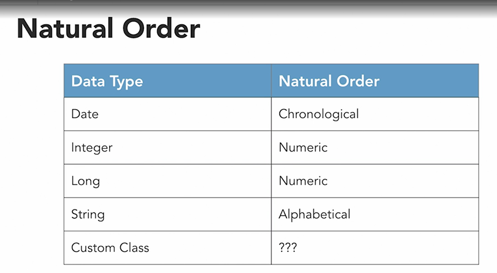  
```java
class Employee implements  Comparable<Employee>{
    private String name;
    private Integer age;
    public Employee(String name, Integer age){
        this.name=name;
        this.age=age;
    }
    public String getName(){return this.name;}
    public String setName(String name){return this.name;}

    public Integer getAge(){return this.age;}
    public Integer setAge(Integer age){return this.age;}

    @Override
    public boolean equals(Object o){
        Employee employee = (Employee)o;
        return this.getName().equals(employee.getName());
    }

    @Override
    public int compareTo(Employee e){
        return this.getName().compareTo(e.getName());
    }
}
```
# compareTo
if this.compareTo(otherThis) > 0 then is greater
if this.compareTo(otherThis) <> 0 then is lower
if this.compareTo(otherThis) = 0 then, the same order

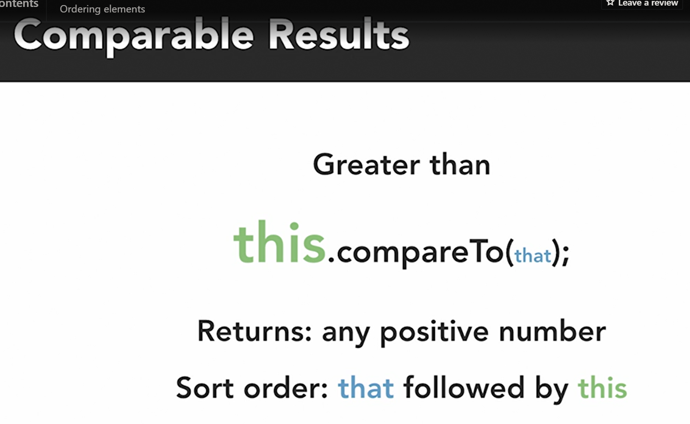  

# Comparator
useful class for comparisons
```java
Comparator.comparing(Employee::getAge).reversed()
```

```java
class Employee{
    private String name;
    private Integer age;
    public Employee(String name, Integer age){
        this.name=name;
        this.age=age;
    }
    public String getName(){return this.name;}
    public String setName(String name){return this.name;}

    public Integer getAge(){return this.age;}
    public Integer setAge(Integer age){return this.age;}

    @Override
    public String toString() {
        return this.name;
    }
}
List<Employee> listEmployee = new LinkedList<Employee>();
listEmployee.add(new Employee("daniel", 20));
listEmployee.add(new Employee("jose", 21));
listEmployee.add(new Employee("alejandra", 11));
Collections.sort(listEmployee, Comparator.comparing(Employee::getName));
listEmployee.sort(Comparator.comparing(Employee::getName));
listEmployee;
```

# Collections object
# Collections sort
```java
class Employee implements  Comparable<Employee>{
    private String name;
    private Integer age;
    public Employee(String name, Integer age){
        this.name=name;
        this.age=age;
    }
    public String getName(){return this.name;}
    public String setName(String name){return this.name;}

    public Integer getAge(){return this.age;}
    public Integer setAge(Integer age){return this.age;}

    @Override
    public boolean equals(Object o){
        Employee employee = (Employee)o;
        return this.getName().equals(employee.getName());
    }

    @Override
    public int compareTo(Employee e){
        return this.getName().compareTo(e.getName());
    }

    @Override
    public String toString() {
        return this.name;
    }
}
List<Employee> listEmployee = new LinkedList<Employee>();
listEmployee.add(new Employee("daniel", 20));
listEmployee.add(new Employee("jose", 21));
listEmployee.add(new Employee("alejandra", 11));
Collections.sort(listEmployee);
Collections.sort(listEmployee, Comparator.naturalOrder());
listEmployee;
```

# Comparator chain
```java
class Employee{
    private String name;
    private Integer age;
    public Employee(String name, Integer age){
        this.name=name;
        this.age=age;
    }
    public String getName(){return this.name;}
    public String setName(String name){return this.name;}

    public Integer getAge(){return this.age;}
    public Integer setAge(Integer age){return this.age;}
}
List<Employee> list = new LinkedList<Employee>();
list.add(new Employee("daniel", 20));
list.add(new Employee("jose", 21));
list.add(new Employee("alejandra", 11));
list.sort(Comparator.comparing(Employee::getName).thenComparing(Employee::getAge).reversed());
```

# Binary search
the collection needs to be sorted
```java
class Employee{
    private String name;
    private Integer age;
    public Employee(String name, Integer age){
        this.name=name;
        this.age=age;
    }
    public String getName(){return this.name;}
    public String setName(String name){return this.name;}

    public Integer getAge(){return this.age;}
    public Integer setAge(Integer age){return this.age;}

    @Override
    public String toString() {
        return this.name;
    }
}
List<Employee> list = new LinkedList<Employee>();
list.add(new Employee("jose", 21));
list.add(new Employee("daniel", 20));
list.add(new Employee("alejandra", 11));
Collections.binarySearch(list, new Employee("daniel", 20), Comparator.comparing(Employee::getName));
Collections.binarySearch(list, new Employee("dniel", 20), Comparator.comparing(Employee::getName));
```

# Collections  binarySearch returns
- returns index of the element
- return negative number, possible new index of the element if were inserted

# Collections min
```java
class Employee{
    private String name;
    private Integer age;
    public Employee(String name, Integer age){
        this.name=name;
        this.age=age;
    }
    public String getName(){return this.name;}
    public String setName(String name){return this.name;}

    public Integer getAge(){return this.age;}
    public Integer setAge(Integer age){return this.age;}

    @Override
    public String toString() {
        return this.name;
    }
}
List<Employee> list = new LinkedList<Employee>();
list.add(new Employee("jose", 21));
list.add(new Employee("daniel", 20));
list.add(new Employee("alejandra", 111));
Collections.min(list, Comparator.comparing(Employee::getName));
Collections.min(list, Comparator.comparing(Employee::getAge));
```

# Collections max
```java
class Employee{
    private String name;
    private Integer age;
    public Employee(String name, Integer age){
        this.name=name;
        this.age=age;
    }
    public String getName(){return this.name;}
    public String setName(String name){return this.name;}

    public Integer getAge(){return this.age;}
    public Integer setAge(Integer age){return this.age;}

    @Override
    public String toString() {
        return this.name;
    }
}
List<Employee> list = new LinkedList<Employee>();
list.add(new Employee("jose", 21));
list.add(new Employee("daniel", 20));
list.add(new Employee("alejandra", 111));
Collections.max(list, Comparator.comparing(Employee::getName));
Collections.max(list, Comparator.comparing(Employee::getAge));
```
